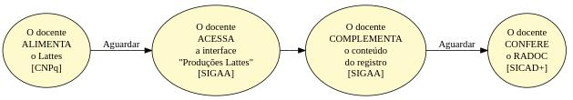
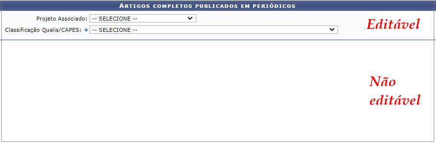

#   Registros RADOC oriundos do <i>LATTES</i>

O conteúdo do _Currículo Lattes_ é uma das <ins>**Fontes de informação do RADOC**</ins>:

> Os tipos de registro passíveis de importação a partir do _Lattes_ são ilustrados [**AQUI**](../media/interface-lattes.jpg).

## FLUXO para Registros RADOC oriundos do _LATTES_

Cabe ao docente COMPLEMENTAR via SIGAA os registros oriundos do _Lattes_:
1. O docente ALIMENTA o _**Lattes**_ com os dados de suas produções e atividades.
1. O docente AGUARDA a importação dos registros no _**Lattes**_ para o RADOC.
1. O docente ACESSA a _interface_ para **Produções Lattes** no SIGAA:
   - Entre no SIGAA.
   - Selecione "Produção Intelectual" >> "Minhas Produções - Lattes".
   - Uma tela (_interface_) é exibida, com os tipos de registro passíveis de importação a partir do _Lattes_:
     - clique [**AQUI**](../media/interface-lattes.jpg) para ver a _interface_ exibida.
1. O docente COMPLEMENTA os registros oriundos do _**Lattes**_:
   - O exemplo (figura abaixo) se refere ao tipo de registro "artigo completo publicado em periódico".
   - O docente precisa complementar:
        - projeto associado; e
        - classificação Qualis/CAPES.
   - Observe que o docente deve complementar o conteúdo na área editável da _interface_. 
1. O docente AGUARDA o processamento dos complementos realizados.
1. O docente CONFERE os dados dos registros no RADOC via SICAD+.

Fim &#9997;
