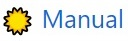

#  Tipos de Registros inseridos de forma MANUAL</i>

Abaixo estão as categorias (grupos) para os tipos de registros RADOC inseridos manualmente:
> Clique nas categorias abaixo, para consultar os tipos de registro de cada categoria.

 

Atividades Acadêmicas – Bancas e Cursos:

- Coordenador de projeto institucional de intercâmbio internacional 
- Cursos, palestras ou treinamento não curricular ministrados para docentes, funcionários ou alunos da UFG 
- Membro de banca de avaliação de memorial ou de tese inédita para promoção à Classe E, com denominação de Professor Titular 
- Membro de banca de defesa de monografia, projeto final de curso e outros tipos de bancas 
- Membro de corpo de júri Concursos Internacionais Membro de corpo de júri Concursos Nacionais

Atividades Acadêmicas – Orientação:

- Aluno com bolsa orientado em projetos de pesquisa, inovação, extensão, cultura e ensino 
- Aluno com deficiência, transtornos globais do desenvolvimento e altas habilidades/superdotação orientado em programa de apoio pedagógico ou em trabalho final de curso 
- Aluno de baixo rendimento acompanhado/orientado por meio de um projeto de ensino aprovado em reunião do Conselho Diretor da Unidade Acadêmica ou em reunião do Colegiado da Unidade Acadêmica Especial 
- Aluno orientado em atividade de Preceptoria 
- Aluno orientado em atividade de Tutoria 
- Aluno orientado em estágio curricular não obrigatório ou estágio docência 
- Aluno orientado em estágio curricular obrigatório 
- Aluno orientado em programa de Intercâmbio Internacional 
- Aluno orientado em programa especial de treinamento (PET) 
- Aluno orientado em programas institucionais de iniciação científica júnior, jovens talentos, apoio técnico e similares 
- Aluno orientado em projeto de final de curso 
- Aluno orientado em prática como componente curricular (PCC) 
- Aluno orientado em residência médica ou em residência multiprofissional em saúde 
- Aluno sem bolsa orientado em projetos de pesquisa, inovação, extensão, cultura e ensino 
- Pesquisador supervisionado em estágio de pós-doutoramento (PRODOC, PNPD, DCR, PDJ, PDS e similares) 

Atividades de Aprendizado e Aperfeiçoamento:

- Curso de aperfeiçoamento realizado com carga horária igual ou superior a 40 horas 
- Curso de aperfeiçoamento realizado com carga horária inferior a 40 horas 
- Docente em licença para capacitação (Artigo 87, Lei N.8112) , com relatório final aprovado em reunião do Conselho Diretor da Unidade Acadêmica ou do Colegiado da Unidade Acadêmica Especial (pontuação por mês de licença) 
- Docente regularmente matriculado em curso de Pós-Graduação stricto sensu com relatórios de pós-graduação aprovados (pontuação por mês de curso) 
- Estágio Pós-Doutoral ou Estágio Sênior (pontuação por mês de estágio) 
- Participação em Congressos, Seminários, Encontros, Jornadas etc 

Outros Tipos de Produções:

- Apresentação de pôsteres em congresso cientifico 
- Apresentação oral de trabalho em congresso científico 
- Artigos de divulgação científica, tecnológica e artística veiculados em jomais e revistas (eletrônico ou impresso) 
- Artigos de opinião veiculados em jornais e revistas (eletrônico ou impresso) 
- Organização de caderno de programação e resumos de eventos 
- Tese, dissertação ou trabalho de iniciação científica premiados por instituições de fomento (sendo o docente o autor ou orientador do produto) 
- Texto ou material didático para uso institucional (não fracionados e com ampla divulgação) 
- Trabalho premiado em evento científico nacional ou internacional

Produção Artística e Cultural:

- Apresentação artistica ou cultural em rádio ou TV 
- Arranjos musicais (canto, coral e orquestral) 
- Composições musicais Editadas 
- Composições musicais Executadas em apresentações públicas 
- Composições musicais Gravadas 
- Composições musicais Publicadas em revistas cientificas 
- Criação de trilha sonora para cinema, televisão ou teatro 
- Criação e produção de projeto de iluminação cênica, figurinos, formas animadas e similares 
- Criação e produção do projeto gráfico de livros: concepção gráfica (mancha gráfica, diagramação, escolha de fonte) 
- Criação, produção e direção de filmes, videos, discos, audiovisuais, coreografias, peças teatrais, óperas ou musicais, ou musicais apresentados em eventos 
- Design de impressos por peça 
- Exposições e apresentações artísticas: Participação coletiva ou coadjuvante 
- Exposições e apresentações artísticas: Participação individual, camerista, solista ou ator principal 
- Fotos publicitárias, jornalísticas, portfólio ou dossiê jornalístico, ensaio jornalístico ou artístico, charge ou ilustração 
- Produção artistica, arquitetônica ou de design premiada em evento 
- Sonoplastia (cinema, música, rádio, televisão, teatro)

Produção Científica:

- Artigos ou textos literários em repositórios de publicação eletrônica ligados a editoras ou universidades 
- Bolsista de Produtividade do CNPq 
- Editor de Anais de Eventos Internacional 
- Editor de Anais de Eventos Nacional 
- Editor de Anais de Eventos Regional ou Local 
- Resenhas, prefácios ou verbetes 
- Resumo de artigo em periódicos especializados nacional ou internacional com corpo editorial 
- Tradução de artigos publicados em periódicos com classificação no Qualis 
- Tradução de resenhas, prefácios ou verbetes

Produção Técnica e Tecnológica:

- Anais, manuais, catálogos, boletins, com ficha bibliográfica (organizador / redator) 
- Conservação de obra artistica 
- Coordenação de mesas redondas, simpósios ou sessões de comunicações 
- Criação e manutenção de páginas em Rede sociais, websites e blogs, vinculados aos projetos de ensino, pesquisa e extensão, na área de atuação do professor 
- Curadoria de exposições 
- Membro de corpo editorial de periódicos com classificação Qualis ou de editora universitária / científica 
- Parecer ad hoc de avaliação de artigos para publicação em periódicos especializados com corpo editorial 
- Parecer ad hoc de avaliação para publicação de livros de editoras com corpo editorial 
- Parecer ad hoc referente a trabalhos a serem apresentados em eventos Resumo 
- Parecer ad hoc referente a trabalhos a serem apresentados em eventos Resumo Expandido 
- Parecer ad hoc referente a trabalhos a serem apresentados em eventos Trabalhos Completos 
- Parecer com anotação de responsabilidade técnica (ART) ou registro de responsabilidade técnica (RRT) 
- Parecer sem anotação de responsabilidade técnica (ART) ou registro de responsabilidade técnica (RRT) 
- Participação em entrevista, mesa redonda, comentário ou programa de rádio, TV, impressos e mídia digital, vinculados à área de atuação do professor 
- Produção de cinema, vídeo, rádio, TV ou mídias digitais vinculados aos projetos de ensino, pesquisa e extensão e veiculados na mídia: Editor, roteirista, diretor e produtor 
- Produção de cinema, vídeo, rádio, TV ou mídias digitais vinculados aos projetos de ensino, pesquisa e extensão e veiculados na mídia: Participante 
- Projeto ou relatório técnico com anotação de responsabilidade técnica (ART) ou registro de responsabilidade técnica (RRT) 
- Projeto ou relatório técnico sem anotação de responsabilidade técnica (ART) ou registro de responsabilidade técnica (RRT) 
- Restauração de obra artistica 
- Revisão ad hoc de periódico científico com classificação Qualis ou de livro publicado com selo de editora que possua corpo editorial

Fim &#9997;
