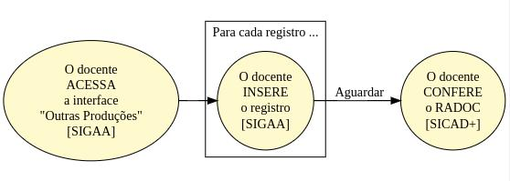

#  Registros RADOC inseridos de forma MANUAL</i>

Alguns registros do RADOC devem ser inseridos pelo docente de forma MANUAL, pois tais não são importados:

> Os tipos de registro <ins>passíveis de inserção manual</ins> são listados [**AQUI**](./fonte-manual-registros.md).

## FLUXO para Registros RADOC inseridos de forma MANUAL

Cabe ao docente INSERIR via SIGAA os registros de forma manual:
1. Inicialmente, o docente ACESSA a _interface_ para **Outras Produções** no SIGAA:
   - Entre no SIGAA.
   - Selecione "Produção Intelectual" >> "Outras Produções".
1. Para **cada registro** a ser inserido:
   1. O docente INSERE o registro via SIGAA:
      1. Clique em "Cadastrar Nova Produção".
      1. Selecione a "Categoria" do tipo de registro.
      1. Selecione o "Tipo de registro" a ser inserido.
      1. Insira os demais dados solicitados, conforme o tipo de registro.
      1. Clique em "Cadastrar".
1. O docente AGUARDA o processamento dos registros inseridos.
1. O docente CONFERE os dados dos registros no RADOC via SICAD+.

Fim &#9997;
