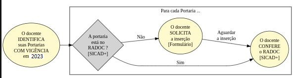

#  Registros RADOC oriundos de <i>PORTARIA</i>

As Portarias emitidas pela UFG são _potencialmente_ uma das <ins>**Fontes de informação do RADOC**</ins>:
> As portarias emitidas via **SIGRH-Portarias**[^1] são automaticamente importadas para o RADOC.

## FLUXO para Registros RADOC oriundos de PORTARIAS

Cabe ao docente AVERIGUAR **se todos** os registros oriundos de portarias estão presentes no RADOC:
1. O docente IDENTIFICA <ins>**todas as suas portarias**</ins>:
   - Portarias que mencionam o seu nome; E
   - Portarias com vigência [de pelo menos um dia] em 2023:
     - inclui portarias emitidas em anos anteriores.
1. Para <ins>**cada uma de suas portarias**</ins>:
   1. O docente CHECA [via SICAD+] se a portaria [e sua pontuação] estão no RADOC via SICAD+.
      1. O formulário para informar atividade realizada com portaria ou documento equivalente em 2022 está com o período de cadastro encerrado.

Fim &#9997;
___
### Para fins de informação ... Ofício Circular 8 (3159832) no Processo SEI 23070.047822/2022-40

O Documento **OFÍCIO CIRCULAR 8 (3159832)** no **Processo SEI 23070.047822/2022-40** versa sobre o uso do software **SIGRH-Portarias**[^1]:
- Sobre as portarias emitidas pela ADMINISTRAÇÃO CENTRAL (Reitoria, Pró-reitorias, etc.):
  - As portarias FORAM EMITIDAS em 2022 via **SIGRH-Portarias**.
- Sobre as portarias emitidas por ÓRGÃOS, UNIDADES ACADÊMICAS ou UNIDADES ACADÊMICAS ESPECIAIS, **que é o caso do INF**:
    - As portarias emitidas **ANTES DE 05 de setembro de 2022** NÃO FORAM emitidas via **SIGRH-Portarias**.
    - As portarias emitidas **A PARTIR DE 05 de setembro de 2022** FORAM emitidas via **SIGRH-Portarias**.

Apesar de saber que as portarias emitidas via **SIGRH-Portarias** são automaticamente importadas para o RADOC:
  - CABE AO DOCENTE AVERIGUAR se <ins>cada uma e suas portarias</ins> está presente no RADOC:
    - O formulário para informar atividade realizada com portaria ou documento equivalente em 2022 está com o período de cadastro encerrado.
  - As portarias de anos anteriores (por exemplo, em 2021) e vigentes em 2022 DEVEM SER AVERIGUADAS.

[^1]: **SIGRH-Portarias** é o sistema gerenciador de portarias na UFG.

Fim &#9997;
