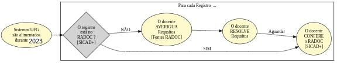

#  Registros RADOC importados de <i>SISTEMAS UFG</i>

Os Sistemas da UFG são uma das <ins>**Fontes de informação do RADOC**</ins>:
> Contudo, há requisitos para que os registros sejam importados e pontuados no RADOC.

## FLUXO para Registros RADOC importados a partir de SISTEMAS da UFG

Cabe ao docente AVERIGUAR <ins>**se os requisitos dos registros foram atendidos**</ins>:
1. Os Sistemas da UFG são ALIMENTADOS durante o Ano 2023:
   - Exemplos de sistemas: SIGAA-Ensino, SIGAA-Extensão, etc.
1. Para <ins>**cada dos registros oriundos de Sistemas UFG**</ins>:
   1. O docente CHECA [via SICAD+] se o registro [e sua pontuação] estão no RADOC:
      - Em caso NEGATIVO:
        1. o docente AVERIGUA se há <ins>**REQUISITOS**</ins> PENDENTES:
           - para tal, o docente CONSULTA a coluna **"Requisitos"** em [<ins>Fontes de Informação</ins>](https://cercomp.ufg.br/p/mapeamento-sicad/);
           - por exemplo, sobre a atividade "III-2.2 Coordenador de programa ou projeto de extensão/cultura cadastrado na PROEC", para que a atividade seja importada e pontuada no RADOC, um dos requisitos é "Cadastro de relatório parcial ou final da ação de extensão, aprovado pela unidade acadêmica e PROEC".
        1. o docente RESOLVE os <ins>**REQUISITOS**</ins> PENDENTES;
        1. o docente AGUARDA o processamento dos requisitos.
   1. O docente CONFERE os dados do registro no RADOC via SICAD+.

Fim &#9997;
