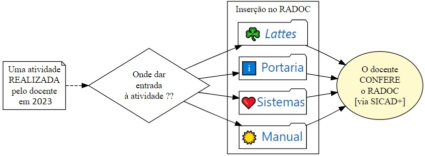

# Fluxos SICAD+

A Figura abaixo busca a esclarecer o **FLUXO GERAL** para a inclusão de registros no RADOC, no contexto do SICAD+.

O fluxo exibido na figura é <ins>recorrente</ins> para as atividades executadas pelo docente em 2023: 

1. O docente realiza uma atividade em 2023.
2. A atividade é então inserida no RADOC. A depender da natureza da atividade, um tipo de registro é escolhido para inserir a atividade no RADOC. Há quatro alternativas principais para a inclusão do registro:

|Alternativa|Descrição (_clique para detalhes sobre cada alternativa_)|
|-|-|
||[O registro é importado a partir do <i>LATTES</i>](./fonte-lattes.md)|
||[O registro é importado de PORTARIAS emitidas pela UFG](./fonte-portaria.md)|
||[O registro é importado a partir de SISTEMAS da UFG](./fonte-sistema.md)|
||[O registro é inserido de forma MANUAL pelo docente](./fonte-manual.md)|

3. O docente utiliza o SICAD+ para conferir se o registro foi corretamente inserido no RADOC.

Fim &#9997;
