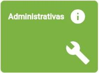

# RADOC: Administrativas

 Clique em uma das tabelas abaixo, para <ins>**instruções**</ins> sobre o tipo de registro RADOC.

<b><H3>TABELA IV–1) <ins>DIREÇÃO E FUNÇÃO GRATIFICADA</ins></H3></b>

|Item|Descrição|Pontos|**COMO INCLUIR**|
|-|-|-|-|
|1|Reitor ou Vice-Reitor ou Pró-Reitor|14 (por mês)|[&#8505; Portaria](./fonte-portaria.md)|
|2|Diretor de Regional da UFG|14 (por mês)|[&#8505; Portaria](./fonte-portaria.md)|
|3|Vice-Diretor de Regional da UFG|12 (por mês)|[&#8505; Portaria](./fonte-portaria.md)|
|4|Coordenadores das Regionais paralelos aos Pró-Reitores da UFG|12 (por mês)|[&#8505; Portaria](./fonte-portaria.md)|
|5|Chefe de Gabinete da Reitoria|10 (por mês)|[&#8505; Portaria](./fonte-portaria.md)|
|6|Coordenador ou Assessor vinculado à Reitoria|10 (por mês)|[&#8505; Portaria](./fonte-portaria.md)|
|7|Assessor vinculado à Diretoria de Regional|10 (por mês)|[&#8505; Portaria](./fonte-portaria.md)|
|8|Diretor de Unidade Acadêmica ou Chefe de Unidade Acadêmica Especial ou do CEPAE|10 (por mês)|[&#8505; Portaria](./fonte-portaria.md)|
|9|Diretor Geral do Hospital das Clínicas|10 (por mês)|[&#8505; Portaria](./fonte-portaria.md)|
|10|Coordenador ou Assessor vinculado às Pró-Reitorias ou às Coordenações das Regionais da UFG|8 (por mês)|[&#8505; Portaria](./fonte-portaria.md)|
|11|Coordenador de Programa de Pós-Graduação stricto sensu|8 (por mês)|[&#8505; Portaria](./fonte-portaria.md)|
|12|Coordenador de Curso de Ensino Básico ou de Graduação|8 (por mês)|[&#8505; Portaria](./fonte-portaria.md)|
|13|Vice-Diretor de Unidade Acadêmica ou Subchefe de Unidade Acadêmica Especial ou do CEPAE|8 (por mês)|[&#8505; Portaria](./fonte-portaria.md)|
|14|Diretor do Hospital Veterinário|8 (por mês)|[&#8505; Portaria](./fonte-portaria.md)|
|15|Diretor de Órgão da Administração (CERCOMP, CGA, CEGRAF, CIAR, DDRH, CS, SIASS, Museu, Rádio, Biblioteca etc.)|8 (por mês)|[&#8505; Portaria](./fonte-portaria.md)|

<b><H3>TABELA IV–2) <ins>ATIVIDADES ADMINISTRATIVAS</ins></H3></b>

  
|Item|Descrição|Pontos|**COMO INCLUIR**|
|-|-|-|-|
|1|Coordenador de projeto institucional com financiamento ou de contratos e convênio com plano de trabalho aprovado|5 (para 12 meses)|[&#8505; Portaria](./fonte-portaria.md)|
|2|Coordenador de curso de especialização, residência médica ou residência multiprofissional em saúde|10 (para 12 meses) (máx. 10)|[&#8505; Portaria](./fonte-portaria.md)|
|3|Vice-Diretor do CIAR ou Subcoordenadores de Cursos de Graduação e de Pós-Graduação stricto sensu|4 (por mês)|[&#8505; Portaria](./fonte-portaria.md)|
|4|Membro representante de classe da carreira docente no CONSUNI|10 (para 12 meses)|[&#8505; Portaria](./fonte-portaria.md)|
|5|Membro do Conselho de Curadores ou das Câmaras Superiores Setoriais ou do Plenário do CEPEC ou de Conselho de Fundações|10 (para 12 meses)|[&#8505; Portaria](./fonte-portaria.md)|
|5.1|Membro do Conselho Gestor das Regionais ou das Câmaras Regionais Setoriais|10 (para 12 meses)|[&#8505; Portaria](./fonte-portaria.md)|
|6|Atividades acadêmicas e administrativas designadas por portaria do Reitor, Pró-Reitor ou Diretor de Unidade Acadêmica, ou Chefe de Unidade Acadêmica Especial ou o Diretor do CEPAE|-|-|
|6.1|.... Com carga horária menor ou igual a 30 horas|2 (para 12 meses)|[&#8505; Portaria](./fonte-portaria.md)|
|6.2|.... Com carga horária maior do que 30 horas e menor ou igual a 60 horas|4 (para 12 meses)|[&#8505; Portaria](./fonte-portaria.md)|
|6.3|.... Com carga horária maior do que 60 horas e menor ou igual a 90 horas|6 (para 12 meses)|[&#8505; Portaria](./fonte-portaria.md)|
|6.4|....	Com carga horária maior do que 90 horas e menor ou igual a 120 horas|8 (para 12 meses)|[&#8505; Portaria](./fonte-portaria.md)|
|6.5|.... Com carga horária maior do que 120 horas e menor ou igual a 150 horas|10 (para 12 meses)|[&#8505; Portaria](./fonte-portaria.md)|
|6.6|.... Com carga horária maior do que 150 horas|12 (para 12 meses)|[&#8505; Portaria](./fonte-portaria.md)|

<b><H3>TABELA IV–3) <ins>OUTRAS ATIVIDADES ADMINISTRATIVAS</ins></H3></b>

  
|Item|Descrição|Pontos|**COMO INCLUIR**|
|-|-|-|-|
|1|Presidente da CPPD|7 (por mês)|[&#8505; Portaria](./fonte-portaria.md)|
|2|Presidente dos Comitês de Ética em Pesquisa (CEP) ou das Comissões de Ética no Uso de Animais (CEUA)|6 (por mês)|[&#8505; Portaria](./fonte-portaria.md)|
|3|Presidente da Comissão de Avaliação Institucional ou da Comissão Própria de Avaliação|5 (por mês)|[&#8505; Portaria](./fonte-portaria.md)|
|4|Membros da Coordenação Permanente do Centro de Seleção|5 (por mês)|[&#8505; Portaria](./fonte-portaria.md)|
|5|Diretores do Hospital das Clínicas|5 (por mês)|[&#8505; Portaria](./fonte-portaria.md)|
|6|Membros da CPPD, da Comissão de Avaliação Institucional, da Comissão Própria de Avaliação, da CAD|5 (por mês)|[&#8505; Portaria](./fonte-portaria.md)|
|7|Membros da CPAD ou da Comissão de Sindicância ou da Comissão de Processo Administrativo|5 (por mês)|[&#8505; Portaria](./fonte-portaria.md)|
|8|Membro do NDE|3 (por mês)|[&#8505; Portaria](./fonte-portaria.md)|
|9|Gestor de Convênios/Projetos Internacionais da Coordenadoria de Assuntos Internacionais|5 (por mês)|[&#8505; Portaria](./fonte-portaria.md)|
|10|Coordenador ou Presidente da Comissão responsável pelas atividades de Pesquisa/Ensino/Extensão/Estágio das Unidades Acadêmicas ou Unidades Acadêmicas Especiais|3 (por mês)|[&#8505; Portaria](./fonte-portaria.md)|
|11|Chefia de Departamento e respectivo vice ou atividade equivalente|3 (por mês)|[&#8505; Portaria](./fonte-portaria.md)|
|12|Chefe do Pronto Socorro ou da Maternidade ou do CEROF do Hospital das Clínicas da UFG e respectivo vice|3 (por mês)|[&#8505; Portaria](./fonte-portaria.md)|
|13|Membros dos Comitês de Ética em Pesquisa (CEP) ou das Comissões de Ética no Uso de Animais (CEUA)|3 (por mês)|[&#8505; Portaria](./fonte-portaria.md)|
|14|Membros do Comitê Interno do PIBIC e do PIBITI|3 (por mês)|[&#8505; Portaria](./fonte-portaria.md)|
|15|Orientador Técnico Titular de Empresa Júnior|3 (por mês)|[&#8505; Portaria](./fonte-portaria.md)|
|16|Orientador Técnico Colaborador de Empresa Júnior|3 (por mês)|[&#8505; Portaria](./fonte-portaria.md)|
|17|Coordenador de Monitoria|3 (por mês)|[&#8505; Portaria](./fonte-portaria.md)|
|18|Coordenador de Módulo de Metodologia Ativa|3 (por mês)|[&#8505; Portaria](./fonte-portaria.md)|
|19|Coordenador de Trabalho de Conclusão de Curso ou de Prática como Componente Curricular|2 (por mês)|[&#8505; Portaria](./fonte-portaria.md)|
|20|Editor de revistas, periódicos ou jornais com periodicidade regular|-|-|
|20.1|.... Com classificação Qualis A|5 (por mês)|[&#8505; Portaria](./fonte-portaria.md)|
|20.2|.... Com classificação Qualis B|4 (por mês)|[&#8505; Portaria](./fonte-portaria.md)|
|20.3|.... Com classificação Qualis C|3 (por mês)|[&#8505; Portaria](./fonte-portaria.md)|
|20.4|.... Sem classificação Qualis|2 (por mês)|[&#8505; Portaria](./fonte-portaria.md)|
|21|Membro de comitê de assessoramento de agências oficiais de fomento (FAPs, Finep, Capes, CNPq)|5 (por mês)|[&#8505; Portaria](./fonte-portaria.md)|
|22|Membros de Comissões ou Conselhos ou Comitês de Órgãos Governamentais (INEP, CNE, outros)|5 (por mês)|[&#8505; Portaria](./fonte-portaria.md)|

Fim &#9997;
