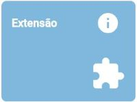

# RADOC: Extensão

 Clique em uma das tabelas abaixo, para <ins>**instruções**</ins> sobre o tipo de registro RADOC.

<H3><b>TABELA III-2) <ins>ATIVIDADES DE EXTENSÃO</ins></H3></b>

|Item|Descrição|Pontos|**COMO INCLUIR**|
|-|-|-|-|
|1|Coordenador de programa ou projeto de extensão aprovado com comprovação de financiamento (exceto para os que são exclusivamente destinado a bolsas)|10 (para 12 meses)|[&#10084; Sistemas](./fonte-sistema.md)|
|2|Coordenador de programa ou projeto de extensão/cultura cadastrado na PROEC III|5 (para 12 meses) (máx. 15)|[&#10084; Sistemas](./fonte-sistema.md)|
|3|Coordenador de contratos e de convênios de cooperação institucional internacional|5 (para 12 meses)|[&#8505; Portaria](./fonte-portaria.md)|
|4|Coordenador de contratos e de convênios de cooperação institucional nacional|3 (para 12 meses)|[&#8505; Portaria](./fonte-portaria.md)|
|5|Participante de projeto de extensão/cultura cadastrado na PROEC|3 (para 12 meses) (máx. 15)|[&#10084; Sistemas](./fonte-sistema.md)|
|6|Curso de extensão ministrado com 20 ou mais horas|5 (máx. 15)|[&#10084; Sistemas](./fonte-sistema.md)|
|7|Curso de extensão ministrado com menos de 20 horas|2 (máx. 10)|[&#10084; Sistemas](./fonte-sistema.md)|
|8|Palestrante, conferencista, participante ou coordenador de mesa redonda em evento científico, cultural ou artístico|-|-|
|8.1|.... Evento internacional|10 (máx. 20)|[&#10084; Sistemas](./fonte-sistema.md)|
|8.2|.... Evento nacional|6 (máx. 12)|[&#10084; Sistemas](./fonte-sistema.md)|
|8.3|.... Evento regional ou local|5 (máx. 10)|[&#10084; Sistemas](./fonte-sistema.md)|
|9|Promoção ou produção de eventos artísticos e científicos locais|-|-|
|9.1|.... Presidente|5|[&#10084; Sistemas](./fonte-sistema.md)|
|9.2|.... Comissão organizadora|3|[&#10084; Sistemas](./fonte-sistema.md)|
|10|Promoção ou produção de eventos artísticos e científicos regionais|-|-|
|10.1|.... Presidente|7|[&#10084; Sistemas](./fonte-sistema.md)|
|10.2|.... Comissão organizadora|4|[&#10084; Sistemas](./fonte-sistema.md)|
|11|Promoção ou produção de eventos artísticos e científicos nacionais|-|-|
|11.1|.... Presidente|10|[&#10084; Sistemas](./fonte-sistema.md)|
|11.2|.... Comissão organizadora|6|[&#10084; Sistemas](./fonte-sistema.md)|
|12|Promoção ou produção de eventos artísticos e científicos internacionais|-|-|
|12.1|.... Presidente|15|[&#10084; Sistemas](./fonte-sistema.md)|
|12.2|.... Comissão organizadora|8|[&#10084; Sistemas](./fonte-sistema.md)|

Fim &#9997;
