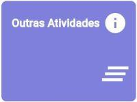

# RADOC: Outras Atividades

 Clique em uma das tabelas abaixo, para saber COMO INCLUIR um registro RADOC.

<b><H3>TABELA V–1) <ins>ATIVIDADES ACADÊMICAS – ORIENTAÇÃO</ins></H3></b>

  
|Item|Descrição|Pontos|**COMO INCLUIR**|
|-|-|-|-|
|1|Aluno orientado em tese de doutorado defendida e aprovada|20|[&#9752; _Lattes_](./fonte-lattes.md)|
|2|Aluno co-orientado em tese de doutorado defendida e aprovada|7|[&#9752; _Lattes_](./fonte-lattes.md)|
|3|Aluno orientado em tese de doutorado em andamento|10|[&#9752; _Lattes_](./fonte-lattes.md)|
|4|Aluno co-orientado em tese de doutorado em andamento|4|[&#9752; _Lattes_](./fonte-lattes.md)|
|5|Aluno orientado em dissertação de mestrado defendida e aprovada|15|[&#9752; _Lattes_](./fonte-lattes.md)|
|6|Aluno co-orientado em dissertação de mestrado defendida e aprovada|5|[&#9752; _Lattes_](./fonte-lattes.md)|
|7|Aluno orientado em dissertação de mestrado em andamento|8|[&#9752; _Lattes_](./fonte-lattes.md)|
|8|Aluno co-orientado em dissertação de mestrado em andamento|3|[&#9752; _Lattes_](./fonte-lattes.md)|
|9|Aluno orientado em monografia de especialização aprovada|8 (máx. 24)|[&#9752; _Lattes_](./fonte-lattes.md)|
|10|Aluno orientado em monografia de especialização em andamento|4 (máx. 12)|[&#9752; _Lattes_](./fonte-lattes.md)|
|11|Aluno orientado em residência médica ou em residência multiprofissional em saúde|5|[&#9728; Manual](./fonte-manual.md)|
|12|Aluno orientado em estágio curricular obrigatório|3|[&#9728; Manual](./fonte-manual.md)|
|13|Aluno orientado em projeto de final de curso|3|[&#9752; _Lattes_](./fonte-lattes.md)|
|14|Aluno de outra IFE orientado em tese de doutorado defendida e aprovada|6|[&#9752; _Lattes_](./fonte-lattes.md)|
|15|Aluno de outra IFE co-orientado em tese de doutorado defendida e aprovada|3|[&#9752; _Lattes_](./fonte-lattes.md)|
|16|Aluno de outra IFE orientado em tese de doutorado em andamento|3|[&#9752; _Lattes_](./fonte-lattes.md)|
|17|Aluno de outra IFE co-orientado em tese de doutorado em andamento|2|[&#9752; _Lattes_](./fonte-lattes.md)|
|18|Aluno de outra IFE orientado em dissertação de mestrado defendida e aprovada|4|[&#9752; _Lattes_](./fonte-lattes.md)|
|19|Aluno de outra IFE co-orientado em dissertação de mestrado defendida e aprovada|2|[&#9752; _Lattes_](./fonte-lattes.md)|
|20|Aluno de outra IFE orientado em dissertação de mestrado em andamento|2|[&#9752; _Lattes_](./fonte-lattes.md)|
|21|Aluno de outra IFE co-orientado em dissertação de mestrado em andamento|1|[&#9752; _Lattes_](./fonte-lattes.md)|
|22|Aluno orientado em programas institucionais de iniciação científica, tecnológica, extensão, ensino e similares (PIBIC / PIVIC / PIBITI / PIVITI / ITI / ITC / PROLICEN / PICMEOBMEP / PROBEC / PROVEC / PIBID)|6|[&#9752; _Lattes_](./fonte-lattes.md)|
|23|Aluno orientado em programas institucionais de iniciação científica júnior, jovens talentos, apoio técnico e similares|5|[&#9728; Manual](./fonte-manual.md)|
|24|Aluno orientado em programa especial de treinamento (PET)|5|[&#9728; Manual](./fonte-manual.md)|
|25|Aluno com bolsa orientado em projetos de pesquisa / inovação / extensão / cultura / ensino|4|[&#9728; Manual](./fonte-manual.md)|
|26|Aluno sem bolsa orientado em projetos de pesquisa, inovação, extensão, cultura e ensino|3|[&#9728; Manual](./fonte-manual.md)|
|27|Aluno orientado em programa de monitoria|3|[&#10084; Sistemas](./fonte-sistemas.md)|
|28|Aluno orientado em estágio curricular não obrigatório ou estágio docência|2|[&#9728; Manual](./fonte-manual.md)|
|29|Aluno orientado em prática como componente curricular (PCC)|1|[&#9728; Manual](./fonte-manual.md)|
|30|Aluno com deficiência, transtornos globais do desenvolvimento e altas habilidades / superdotação orientado em programa de apoio pedagógico ou em trabalho final de curso|20 (máx. 40)|[&#9728; Manual](./fonte-manual.md)|
|31|Pesquisador supervisionado em estágio de pós-doutoramento (PRODOC, PNPD, DCR, PDJ, PDS e similares)|8|[&#9752; _Lattes_](./fonte-lattes.md)|
|32|Aluno orientado em atividade de Preceptoria|1|[&#9728; Manual](./fonte-manual.md)|
|33|Aluno orientado em atividade de Tutoria|1|[&#9728; Manual](./fonte-manual.md)|
|34|Aluno orientado em Programa de Intercâmbio Internacional|1|[&#9728; Manual](./fonte-manual.md)|
|35|Aluno de baixo rendimento acompanhado/orientado por meio de um projeto de ensino aprovado em reunião do Conselho Diretor da Unidade Acadêmica ou em reunião do Colegiado da Unidade Acadêmica Especial|4 (máx. 20)|[&#9728; Manual](./fonte-manual.md)|

<b><H3>TABELA V–2) <ins>ATIVIDADES ACADÊMICAS – BANCAS E CURSOS</ins></H3></b>

  
|Item|Descrição|Pontos|**COMO INCLUIR**|
|-|-|-|-|
|1|Membro de banca de concurso para docente efetivo|-|-|
|1.1|.... Na instituição|4|[&#9752; _Lattes_](./fonte-lattes.md)|
|1.2|.... Em outra instituição|6|[&#9752; _Lattes_](./fonte-lattes.md)|
|2|Membro de banca de concurso para docente substituto|2|[&#9752; _Lattes_](./fonte-lattes.md)|
|3|Membro de banca de defesa de dissertação de mestrado|-|-|
|3.1|.... Na instituição|4|[&#9752; _Lattes_](./fonte-lattes.md)|
|3.2|.... Em outra instituição|6|[&#9752; _Lattes_](./fonte-lattes.md)|
|4|Membro de banca de defesa de tese de doutorado|-|-|
|4.1|.... Na instituição|6|[&#9752; _Lattes_](./fonte-lattes.md)|
|4.2|.... Em outra instituição|8|[&#9752; _Lattes_](./fonte-lattes.md)|
|5|Membro de banca de qualificação de mestrado|-|-|
|5.1|.... Na instituição|3|[&#9752; _Lattes_](./fonte-lattes.md)|
|5.2|.... Em outra instituição|4|[&#9752; _Lattes_](./fonte-lattes.md)|
|6|Membro de banca de qualificação de doutorado|-|-|
|6.1|.... Na instituição|5|[&#9752; _Lattes_](./fonte-lattes.md)|
|6.2|.... Em outra instituição|6|[&#9752; _Lattes_](./fonte-lattes.md)|
|7|Membro de banca de avaliação de memorial ou de tese inédita para promoção à Classe E, com denominação de Professor Titular|-|-|
|7.1|.... Na instituição|6|[&#9752; _Lattes_](./fonte-lattes.md)|
|7.2|.... Em outra instituição|8|[&#9752; _Lattes_](./fonte-lattes.md)|
|8|Membro de banca de defesa de monografia, projeto final de curso e outros tipos de bancas|3 (máx. 12)|Graduação e Especialização via [&#9752; _Lattes_](./fonte-lattes.md) Outros tipos de bancas via [&#9728; Manual](./fonte-manual.md)|
|9|Membro de corpo de júri|-|-|
|9.1|.... Concursos internacionais|8|[&#9728; Manual](./fonte-manual.md)|
|9.2|.... Concursos nacionais|6|[&#9728; Manual](./fonte-manual.md)|
|10|Cursos, palestras ou treinamento não curricular ministrados para docentes, funcionários ou alunos da UFG|2|[&#9728; Manual](./fonte-manual.md)|
|11|Coordenador de projeto institucional de intercâmbio internacional|10 (para 12 meses)|[&#9728; Manual](./fonte-manual.md)|

<b><H3>TABELA V–3) <ins>ATIVIDADES DE APRENDIZADO E APERFEIÇOAMENTO</ins></H3></b>

  
|Item|Descrição|Pontos|**COMO INCLUIR**|
|-|-|-|-|
|1|Docente regularmente matriculado em curso de Pós-Graduação stricto sensu com relatórios de pós-graduação aprovados|12 (por mês)|[&#9728; Manual](./fonte-manual.md)|
|2|Estágio Pós-Doutoral ou Estágio Sênior|12 (por mês)|[&#9728; Manual](./fonte-manual.md)|
|3|Docente em licença para capacitação (Artigo 87, Lei N.8112) , com relatório final aprovado em reunião do Conselho Diretor da Unidade Acadêmica ou do Colegiado da Unidade Acadêmica Especial|12 (por mês)|[&#9728; Manual](./fonte-manual.md)|
|4|Curso de aperfeiçoamento realizado com carga horária igual ou superior a 40 horas|3|[&#9728; Manual](./fonte-manual.md)|
|5|Curso de aperfeiçoamento realizado com carga horária inferior a 40 horas|1|[&#9728; Manual](./fonte-manual.md)|
|6|Participação em Congressos, Seminários, Encontros, Jornadas etc.|2 (máx. 10)|[&#9728; Manual](./fonte-manual.md)|

Fim &#9997;
