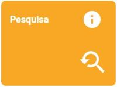

# RADOC: Pesquisa

 Clique em uma das tabelas abaixo, para <ins>**instruções**</ins> sobre o tipo de registro RADOC.

<H3><b>TABELA III-1) <ins>ATIVIDADES DE COORDENAÇÃO DE PESQUISA E INOVAÇÃO</ins></H3></b>

  
|Item|Descrição|Pontos|**COMO INCLUIR**|
|-|-|-|-|
|1|Coordenador de projeto conjuntos de pesquisa e cooperação científica (tipo PRODOC, PROCAD, PNPD, entre outros) e de cursos MINTER e DINTER aprovados por órgãos oficiais de fomento|10 (para 12 meses) |[&#8505; Portaria](./fonte-portaria.md)|
|2|Coordenador de projeto de pesquisa ou inovação aprovado com comprovação de financiamento (exceto para os que são exclusivamente destinado a bolsas)|10 (para 12 meses) |[&#10084; Sistemas](./fonte-sistemas.md)|
|3|Coordenador de projeto de pesquisa ou inovação aprovado sem financiamento|5 (para 12 meses) (máx. 10) |[&#10084; Sistemas](./fonte-sistemas.md)|

Fim &#9997;
