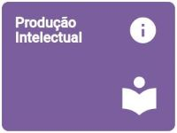

# RADOC: Produção Intelectual

 Clique em uma das tabelas abaixo, para <ins>**instruções**</ins> sobre o tipo de registro RADOC.

<b><H3>TABELA II–1) <ins>PRODUÇÃO CIENTÍFICA</ins></H3></b>

|Item|Descrição|Pontos|**COMO INCLUIR**|
|-|-|-|-|
|1|Artigo completo ou texto literário publicado em periódico IMPORTANTE: Para ter o <ins><b>QUALIS</b></ins>, use este [<ins><b>PORTAL</b></ins>]( https://ppgcc.github.io/discentesPPGCC/pt-BR/qualis/), que é baseado no [<ins><b>RELATÓRIO DE ÁREA</b></ins>]( https://www.gov.br/capes/pt-br/centrais-de-conteudo/documentos/avaliacao/qualis_periodico_eventos_cientifico_Ciencia_Computacao.pdf)|-|-|
|1.1|.... Com classificação no Qualis/CAPES **A**|25|[&#9752; _Lattes_](./fonte-lattes.md)|
|1.2|.... Com classificação no Qualis/CAPES **B**|20|[&#9752; _Lattes_](./fonte-lattes.md)|
|1.3|.... Com classificação no Qualis/CAPES **C**|15|[&#9752; _Lattes_](./fonte-lattes.md)|
|1.4|.... Não sujeito à classificação no Qualis/CAPES|10 (máx. 10)|[&#9752; _Lattes_](./fonte-lattes.md)|
|2|Resumo de artigo em periódicos especializados nacional ou internacional com corpo editorial|5|[&#9728; Manual](./fonte-manual.md)|
|3|Artigos ou textos literários em repositórios de publicação eletrônica ligados a editoras ou universidades|5 (máx. 10)|[&#9728; Manual](./fonte-manual.md)|
|4|Resumo expandido publicado em anais de congresso|(máx. 10)|-|
|4.1|....	Internacional|8|[&#9752; _Lattes_](./fonte-lattes.md)|
|4.2|.... Nacional|6|[&#9752; _Lattes_](./fonte-lattes.md)|
|4.3|....	Regional ou Local|4|[&#9752; _Lattes_](./fonte-lattes.md)|
|5|Resumo simples publicado em anais de congresso|(máx. 10)|-|
|5.1|.... Internacional|4|[&#9752; _Lattes_](./fonte-lattes.md)|
|5.2|.... Nacional|3|[&#9752; _Lattes_](./fonte-lattes.md)|
|5.3|.... Regional ou Local|2|[&#9752; _Lattes_](./fonte-lattes.md)|
|6|Trabalho completo publicado em anais de congresso científico|10|[&#9752; _Lattes_](./fonte-lattes.md)|
|7|Livro publicado com selo de editora que possua corpo editorial|40|[&#9752; _Lattes_](./fonte-lattes.md)|
|8|Livro publicado com selo de editora que não possua corpo editorial|10|[&#9752; _Lattes_](./fonte-lattes.md)|
|9|Capítulo de livro publicado com selo de editora que possua corpo editorial|10 (máx. 40)|[&#9752; _Lattes_](./fonte-lattes.md)|
|10|Edição ou organização de livro (coletânea) publicado com selo de editora que possua corpo editorial|12|[&#9752; _Lattes_](./fonte-lattes.md)|
|11|Capítulo traduzido de livro publicado com selo de editora que possua corpo editorial|5 (máx. 20)|[&#9752; _Lattes_](./fonte-lattes.md)|
|12|Tradução de livro publicado com selo de editora que possua corpo editorial|20|[&#9752; _Lattes_](./fonte-lattes.md)|
|13|Tradução de artigos publicados em periódicos com classificação no Qualis|10|[&#9728; Manual](./fonte-manual.md)|
|14|Resenhas, prefácios ou verbetes|5|[&#9728; Manual](./fonte-manual.md)|
|15|Tradução de resenhas, prefácios ou verbetes|2|[&#9728; Manual](./fonte-manual.md)|
|16|Livro didático desenvolvido para projetos institucionais/governamentais|10|[&#9752; _Lattes_](./fonte-lattes.md)|
|17|Editor de Anais de Eventos|(máx. 1 evento)|-|
|17.1|.... Internacional|15|[&#9728; Manual](./fonte-manual.md)|
|17.2|.... Nacional|10|[&#9728; Manual](./fonte-manual.md)|
|17.3|.... Regional ou Local|5|[&#9728; Manual](./fonte-manual.md)|
|18|Dissertação de Mestrado defendida e aprovada (sendo o docente o autor da dissertação)|20|[&#9752; _Lattes_](./fonte-lattes.md)|
|19|Tese de Doutorado defendida e aprovada (sendo o docente o autor da tese)|40|[&#9752; _Lattes_](./fonte-lattes.md)|
|20|Bolsista de Produtividade do CNPq|20 (para 12 meses)|[&#9728; Manual](./fonte-manual.md)|

<b><H3>TABELA II–2) <ins>PRODUÇÃO ARTÍSTICA E CULTURAL</ins></H3></b>

|Item|Descrição|Pontos|**COMO INCLUIR**|
|-|-|-|-|
|1|Criação, produção e direção de filmes, vídeos, discos, audiovisuais, coreografias, peças teatrais, óperas ou musicais, ou musicais apresentados em eventos|-|-|
|1.1|.... Locais ou regionais|10|[&#9752; _Lattes_](./fonte-lattes.md)|
|1.2|.... Nacionais|15|[&#9752; _Lattes_](./fonte-lattes.md)|
|1.3|.... Internacionais|20|[&#9752; _Lattes_](./fonte-lattes.md)|
|2|Criação e produção do projeto gráfico de livros: concepção gráfica (mancha gráfica, diagramação, escolha de fonte)|10|[&#9752; _Lattes_](./fonte-lattes.md)|
|3|Criação de trilha sonora para cinema, televisão ou teatro|15|[&#9752; _Lattes_](./fonte-lattes.md)|
|4|Criação e produção de projeto de iluminação cênica, figurinos, formas animadas e similares|15|[&#9752; _Lattes_](./fonte-lattes.md)|
|5|Design de impressos por peça|1 (máx. 20)|[&#9752; _Lattes_](./fonte-lattes.md)|
|6|Exposições e apresentações artísticas locais ou regionais|-|-|
|6.1|.... Participação individual, camerista, solista ou ator principal|16|[&#9752; _Lattes_](./fonte-lattes.md)|
|6.2|.... Participação coletiva ou coadjuvante|5|[&#9752; _Lattes_](./fonte-lattes.md)|
|7|Exposições e apresentações artísticas nacionais|-|-|
|7.1|.... Participação individual, camerista, solista ou ator principal|20|[&#9752; _Lattes_](./fonte-lattes.md)|
|7.2|.... Participação coletiva ou coadjuvante|10|[&#9752; _Lattes_](./fonte-lattes.md)|
|8|Exposições e apresentações artísticas internacionais|-|-|
|8.1|.... Participação individual, camerista, solista ou ator principal|20|[&#9752; _Lattes_](./fonte-lattes.md)|
|8.2|.... Participação coletiva ou coadjuvante|15|[&#9752; _Lattes_](./fonte-lattes.md)|
|9|Composições musicais|-|-|
|9.1|.... Editadas|20|[&#9752; _Lattes_](./fonte-lattes.md)|
|9.2|.... Publicadas em revistas científicas|20|[&#9752; _Lattes_](./fonte-lattes.md)|
|9.3|.... Gravadas|20|[&#9752; _Lattes_](./fonte-lattes.md)|
|9.4|.... Executadas em apresentações públicas|15|[&#9752; _Lattes_](./fonte-lattes.md)|
|10|Produção artística, arquitetônica ou de design premiada em evento|-|-|
|10.1|.... Local ou regional|5|[&#9752; _Lattes_](./fonte-lattes.md)|
|10.2|.... Nacional|10|[&#9752; _Lattes_](./fonte-lattes.md)|
|10.3|.... Internacional|15|[&#9752; _Lattes_](./fonte-lattes.md)|
|11|Arranjos musicais (canto, coral e orquestral)|5|[&#9752; _Lattes_](./fonte-lattes.md)|
|12|presentação artística ou cultural em rádio ou TV|5|[&#9752; _Lattes_](./fonte-lattes.md)|
|13|Sonoplastia (cinema, música, rádio, televisão, teatro)|3|[&#9752; _Lattes_](./fonte-lattes.md)|
|14|Fotos publicitárias, jornalísticas, portfólio ou dossiê jornalístico, ensaio jornalístico ou artístico, charge ou ilustração|3 (máx. 15)|[&#9752; _Lattes_](./fonte-lattes.md)|

<b><H3>TABELA II–3) <ins>PRODUÇÃO TÉCNICA E TECNOLÓGICA</ins></H3></b>

|Item|Descrição|Pontos|**COMO INCLUIR**|
|-|-|-|-|
|1|Desenvolvimento de programa de computador (software) com registro no INPI ou com disponibilização em ambientes de software livre|20|[&#9752; _Lattes_](./fonte-lattes.md)|
|2|Desenvolvimento de software com divulgação em periódicos indexados e com corpo editorial ou em anais de congresso científico|10|[&#9752; _Lattes_](./fonte-lattes.md)|
|3|Desenvolvimento de software para uso institucional|5 (máx. 10)|[&#9752; _Lattes_](./fonte-lattes.md)|
|4|Desenvolvimento e registro no INPI de topografia de circuito integrado|20|[&#9752; _Lattes_](./fonte-lattes.md)|
|5|Desenvolvimento de produto, processo ou técnica com registro de patente no INPI ou modelo de utilidade|20|[&#9752; _Lattes_](./fonte-lattes.md)|
|6|Desenvolvimento e registro no INPI de desenho industrial|20|[&#9752; _Lattes_](./fonte-lattes.md)|
|7|Desenvolvimento e registro no INPI de processo de indicação geográfica|20|[&#9752; _Lattes_](./fonte-lattes.md)|
|8|Desenvolvimento e registro no INPI de marcas|5|[&#9752; _Lattes_](./fonte-lattes.md)|
|9|Membro de corpo editorial de periódicos com classificação Qualis ou de editora universitária / científica|10 (para 12 meses)|[&#9728; Manual](./fonte-manual.md)|
|10|Parecer ad hoc de avaliação para publicação de livros de editoras com corpo editorial|8 (máx. 30)|[&#9728; Manual](./fonte-manual.md)|
|11|Parecer ad hoc de avaliação de artigos para publicação em periódicos especializados com corpo editorial|6 (máx. 30)|[&#9728; Manual](./fonte-manual.md)|
|12|Parecer ad hoc referente a trabalhos a serem apresentados em eventos|(máx. 20)|-|
|12.1|.... Trabalho completo|5|[&#9728; Manual](./fonte-manual.md)|
|12.2|.... Resumo expandido|3|[&#9728; Manual](./fonte-manual.md)|
|12.3|.... Resumo|1|[&#9728; Manual](./fonte-manual.md)|
|13|Revisão ad hoc de periódico científico com classificação Qualis ou de livro publicado com selo de editora que possua corpo editorial|10 (máx. 20)|[&#9728; Manual](./fonte-manual.md)|
|14|Coordenação de mesas redondas, simpósios ou sessões de comunicações|2 (máx. 10)|[&#9728; Manual](./fonte-manual.md)|
|15|Projeto, parecer ou relatório técnico realizado em consultoria  ou assessoria oficializada por convite, convênio, contrato ou designação|-|-|
|15.1|.... Parecer com anotação de responsabilidade técnica (ART) ou registro de responsabilidade técnica (RRT)|10|[&#9728; Manual](./fonte-manual.md)|
|15.2|.... Parecer sem anotação de responsabilidade técnica (ART) ou registro de responsabilidade técnica (RRT)|5|[&#9728; Manual](./fonte-manual.md)|
|15.3|.... Projeto ou relatório técnico com anotação de responsabilidade técnica (ART) ou registro de responsabilidade técnica (RRT)|20|[&#9728; Manual](./fonte-manual.md)|
|15.4|.... Projeto ou relatório técnico sem anotação de responsabilidade técnica (ART) ou registro de responsabilidade técnica (RRT)|10|[&#9728; Manual](./fonte-manual.md)|
|16|Anais, manuais, catálogos, boletins, com ficha bibliográfica (organizador / redator)|5|[&#9728; Manual](./fonte-manual.md)|
|17|Produção e publicação de mapas, cartas ou similares|10|[&#9752; _Lattes_](./fonte-lattes.md)|
|18|Desenvolvimento de maquete|5|[&#9752; _Lattes_](./fonte-lattes.md)|
|19|Manutenção de obra artística|-|-|
|19.1|.... Restauração de obra artística|20|[&#9728; Manual](./fonte-manual.md)|
|19.2|.... Conservação de obra artística|10 (para 12 meses)|[&#9728; Manual](./fonte-manual.md)|
|20|Curadoria de exposições|5|[&#9728; Manual](./fonte-manual.md)|
|21|Produção de cinema, vídeo, rádio, TV ou mídias digitais vinculados aos projetos de ensino, pesquisa e extensão e veiculados na mídia|-|-|
|21.1|.... Editor, roteirista, diretor e produtor|20 (para 12 meses)|[&#9728; Manual](./fonte-manual.md)|
|21.2|.... Participante|3 (máx. 9)|[&#9728; Manual](./fonte-manual.md)|
|22|Criação e manutenção de páginas em Rede sociais, websites e blogs, vinculados aos projetos de ensino, pesquisa e extensão, na área de atuação do professor|4 (para 12 meses) (máx. 4)|[&#9728; Manual](./fonte-manual.md)|
|23|Participação em entrevista, mesa redonda, comentário ou programa de rádio, TV, impressos e mídia digital, vinculados à área de atuação do professor|(máx 10)|-|
|23.1|.... Regional/Local|2|[&#9728; Manual](./fonte-manual.md)|
|23.2|.... Nacional|3|[&#9728; Manual](./fonte-manual.md)|
|23.3|.... Internacional|4|[&#9728; Manual](./fonte-manual.md)|

<b><H3>TABELA II–4) <ins>OUTRO TIPO DE PRODUÇÃO</ins></H3></b>

|Item|Descrição|Pontos|**COMO INCLUIR**|
|-|-|-|-|
|1|Artigos de opinião veiculados em jornais e revistas (eletrônico ou impresso)|1|[&#9728; Manual](./fonte-manual.md)|
|2|Texto ou material didático para uso institucional (não fracionados e com ampla divulgação)|2|[&#9728; Manual](./fonte-manual.md)|
|3|Artigos de divulgação científica, tecnológica e artística veiculados em jornais e revistas (eletrônico ou impresso)|3|[&#9728; Manual](./fonte-manual.md)|
|4|Apresentação oral de trabalho em congresso científico|3 (máx. 9)|[&#9728; Manual](./fonte-manual.md)|
|5|Apresentação de pôsteres em congresso científico|1 (máx. 3)|[&#9728; Manual](./fonte-manual.md)|
|6|Organização de caderno de programação e resumos de eventos|3 (máx. 9)|[&#9728; Manual](./fonte-manual.md)|
|7|Trabalho premiado em evento científico nacional ou internacional|5|[&#9728; Manual](./fonte-manual.md)|
|8|Tese, dissertação ou trabalho de iniciação científica premiados por instituições de fomento (sendo o docente o autor ou orientador do produto)|8|[&#9728; Manual](./fonte-manual.md)|

Fim &#9997;
