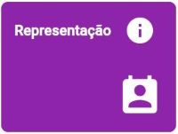

# RADOC: Representação

 Clique em uma das tabelas abaixo, para <ins>**instruções**</ins> sobre o tipo de registro RADOC.

<b><H3>TABELA IV–4) <ins>ATIVIDADES DE REPRESENTAÇÃO FORA DA UFG</ins></H3></b>

  
|Item|Descrição|Pontos|**COMO INCLUIR**|
|-|-|-|-|
|1|Representante titular em conselho de classe profissional com carga horária igual ou superior a 150 horas|10 (para 12 meses) (para 150h)|[&#8505; Portaria](./fonte-portaria.md)|
|2|Presidente do Sindicato de Docentes da UFG|10 (para 12 meses)|[&#8505; Portaria](./fonte-portaria.md)|
|3|Diretor do Sindicato de Docentes da UFG|3 (para 12 meses)|[&#8505; Portaria](./fonte-portaria.md)|
|4|Representante sindical com carga horária igual ou superior a 150 horas|10 (para 12 meses) (para 150h)|[&#8505; Portaria](./fonte-portaria.md)|
|5|Representante em entidade científica, artística e cultural com carga horária igual ou superior a 150 horas|10 (para 12 meses) (para 150h)|[&#8505; Portaria](./fonte-portaria.md)|
|6|Representante em comissão de órgão governamental com carga horária igual ou superior a 150 horas|10 (para 12 meses) (para 150h)|[&#8505; Portaria](./fonte-portaria.md)|

Fim &#9997;
