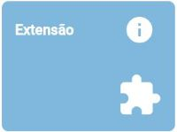

# Painel: Alimentar o RADOC

O Painel abaixo busca a orientar o docente sobre <ins>**como inserir registros**</ins> no RADOC:
> O painel é baseado na _interface_ do SICAD+. Clique no cartão que melhor denota o registro a ser inserido.

 

Fim &#9997;
###### *by [Comissão INF/UFG para o RADOC 2023](./x-index.md#comissão-radoc-2023)*
