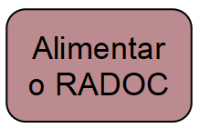
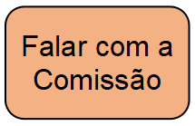

# Painel: Visão geral

> Os cartões abaixo orientam sobre o RADOC no contexto do SICAD+: &#9749; Sugestão: inicie pelo primeiro cartão e siga os cartões em sentido horário.

<!---  --->

 

Fim	&#9749;
###### *by [Comissão INF/UFG para o RADOC 2023](./x-index.md#comissão-radoc-2023)*
